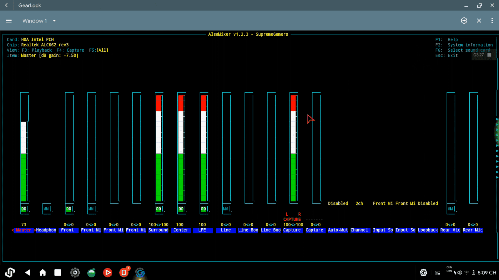

We’ve all been busy this past year, and we feel it’s time to share some of the things we’ve been working on behind the scenes. With the expansion of Bliss OS, Android-Genric Project and others on the PC side, there has been a lot going on that hardly anybody knows about, so here’s a rundown on what’s happening.

# Android-x86

Behind the scenes, we are working to update Android 9, 10 & 11 branches of Android-x86. First, with the arm64 updates we worked out months ago with Bliss OS 11, so those will be heading to the pie-x86 branch along with some commits for Taskbar also to help move that to a prebuilt method of inclusion that will allow updates through Play Store.

The Android-11 updates will likely run a little behind as we would like to also update the Android 10 branches with all the progress we have made elsewhere that hasn’t been merged upstream yet. So please be patient for those as we are working on it, but it takes time.

In other news, Android-x86 Project’s **Maurossi** has some highlights about development on the graphics stack and the upcoming work on it’s q-x86 & r-x86 branch:

> Mesa 21.0.0 was kept in building state and working for drm_gralloc, gbm_gralloc and minigbm gralloc1 (intel), nouveau threading WIP does not make nouveau stable with NVC0 chipsets, so nouveau will most probably stay blacklisted in oreo-x86 and later. minigbm with generic dri backend works with r600, radeonsi and nouveau (with cursor tiling artifacts, just mentioning as I was hoping that nouveau could become stable) – as a side note rsglobal effort will be shifted to mesa libgbm based backend and generic dri backend with minigbm “own gbm buffer management” will be abandoned. as part of the benefits i965 should start working, while it is now crashing.

> drm_hwcomposer rebase to main branch with the overhead of patches for Android P does not seem to work better than q-x86 branch, some changes in the planes composition have a negative effects on x86 GPUs resulting in black or shadowed on main buffer of System UI window, which forces to disable HardwareComposer, so for x86 devices drm_hwcomposer is not as useful as it used to be and drmfb-composer works ok.

> If Android R 11.0.0_r24 and later supports only binderized HALs we will need to abandon drm_gralloc and at the moment gbm_gralloc supports i965, r600, radeonsi, while nouveau is still affected by cursor tiling artifacts, should it became stable with finalization of threading support. 

> We are also waiting to see if minigbm with generic backend will materialize in the next months.

> As a side note, Vulkan API is broken with current r-x86 unpublished manifest, but it is pretty much fine with q-x86 even with mesa 21.1.0-devel and kernel-5.12rc2, where testing is successful with V1 Benchmark Pro X64, so there is a problem with the r-x86 source still.
    
> -- Maurossi

# Supreme-Gamers (Gearlock, Advanced Android-x86 installer, etc.)

The SG team has been working hard at building up the Android-x86 gaming community, releasing a number of new videos to help drive interest in the platform ([https://www.youtube.com/c/SupremeGamers/videos](https://www.youtube.com/c/SupremeGamers/videos)) as well as expanding their forums with lots of new updates to Gearlock and a ton of new Gearlock-Extensions. Be sure to check them out: [https://supreme-gamers.com/r/](https://supreme-gamers.com/r/)

In other SG development, we get some audio improvements with HMTheBoy154’s (Huy Minh) libncurses + alsa-utils is ready to compile, the good news is that if you compile libncurses with a Gearlock system you won’t need to set and copy terminfo anymore since it is included with Gearlock. For alsa-utils we will have alsamixer:

> This ncurses tool will help user interact with audio config easier like Linux. Which means users can control their audio I/O 90% so far. The remaining 10% left is switching devices, between multiple inputs/outputs which this tool doesn’t do but 2 props (hal.audio.in and hal.audio.out) do, so for this, we are still looking for a way to edit those effectively also.
> -- HMTheBoy154

# Boringdroid

Utzcoz has converted BoringdroidSettings to kotlin and add spotless to check code style for it. He has also added spotless to BoringdroidSystemUI. The next step will start to add tests to those apps. There are two features added to BoringdroidSystemUI, adding tooltips for all app state icon, and drag and drop to remove window for all app state icon. He also changed the updating policy for the Boringdroid, and will focus on the newest Boringdroid version, for example, current is boringdroid-11.0.0, and develop new features and bugfixs for it only moving forward. Unless some very important features are need by users, most new features will only be on the newest version available due to time and development constraints. Another thing the Boringdroid will do is to delivery BoringdroidSystemUI and BoringdroidSettings with apks to the Boringdroid, and separate the development of those apps from the system, that will  help to remove Android.bp compatibility to let the app use the newest version of dependencies, and other awesome libraries.

# Android-Generic Project

Things are starting to take shape with us and Astian co-leading the project. We have worked out most of the “how” for a new foss vendor based on Astian apps and services, and have been working hard at a complete rewrite of AG from the ground up to better support end users. Some of the things on the table for that rewrite are modular addons, a GUI, integrated manifest and project folder handling, and much much more. Some of the work has also been done on coding the new GSI scripts, and adding x86, x86_arm, x86_64 & x86_64_arm64 GSI targets.

The next steps for AG will include working out a NEW set of scripts to help handle the import/export of many common ROM device trees, and with luck, figuring out a way to determine if a device tree requires something not already in the source, and pull it in. The other side of our planned AG expansion will be to add multiple options for further customization of the branding on our builds.

# Astian

The entire Astian team has been working hard at laying the groundwork for our next few steps in development, setting up repos, servers, community threads and diving in deep on planning our next few steps as well as working on developing the plan for a number of the apps we have in store. Astian Cloud updates are starting to roll out (here), and this is step 1 for our future plans for Astian Services.
We are also planning out hardware strategy for Android-Generic Project with Astian and will be releasing some information on those developments soon as well. Stay Tuned

# Bliss

JackEagle has started transitioning from ROM Development to the PC side of development and we are working on moving most of Bliss development to this side for the time being as we feel the PC side of things is where we have been able to have the greatest impact on the community. This transition is also taking place in order for us to not have to stress so hard over the tremendous workload on our shoulders, so we can learn to enjoy what we’ve been doing once again. As many ROM teams can empathize with, working it all alone is not easy and tends to suck the fun out of the project faster than anything. So we figured it’s about time we unite our efforts and work together this round.

With that being said, we are working on a ton of other updates to Bliss as an org. The first of those updates comes in the form of a redesigned logo and branding guide for Bliss.

More updates for Bliss Infrastructure are right around the corner, including social media updates, and our next onboarding phase. That’s where we are going to be focusing on bringing on new talent for design, app development, ROM/OS development, and web development. We will also be taking steps to ensure that members of the team do not feel pressured from development stress, as well as making sure that the toxic parts of the community are filtered out of their workflow. We want this to be as Blissful as possible for everyone involved, so we are taking our time here to ensure an exemplary solution is executed. 