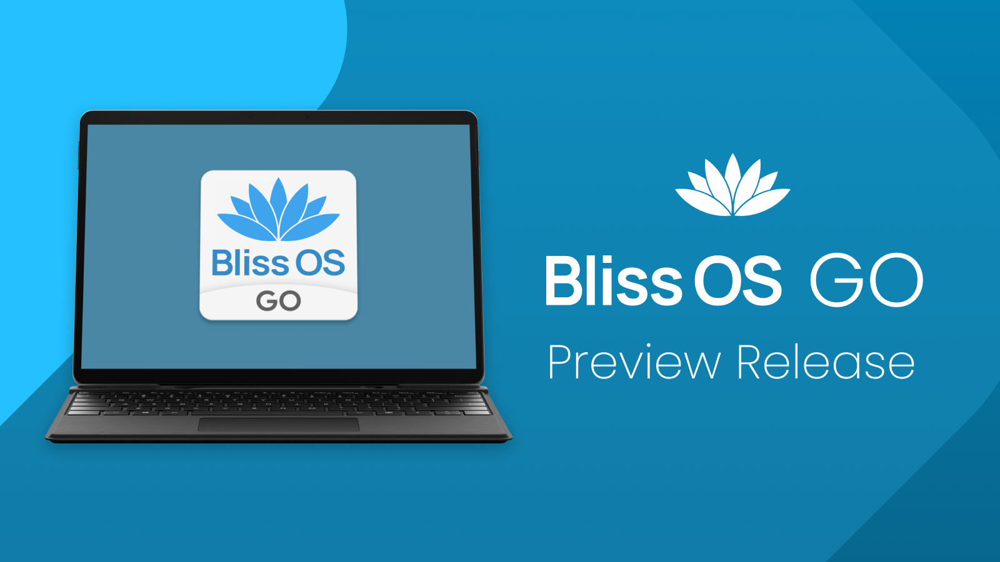

# Collaboration Announcement

## [Announcement] Bliss OS Go (Preview Release)

Bliss OS Go is a new variation of Bliss OS that is designed to run on low-end devices. It is based on Android Go, which is a version of Android that is optimized for devices with limited resources. Bliss OS Go includes a number of features that are designed to improve performance, battery life and usability on low-end devices, such as:

- A lower-spec config for recents
- A lower-spec config for task management
- Expanded configuration options
- And much more

Bliss OS Go is currently in release for a number of low-end devices, including:

- Intel Atom devices
- Intel Celeron N/M devices
- Intel Pentium devices
- AMD APU/CPUs

If you have a low-end device and you are looking for a new operating system that will improve performance and battery life, then Bliss OS Go is a great option.

Here are some additional details about the features of Bliss OS Go:

- Lower-spec configs for recents and task management: These configs reduce the amount of resources that are used by the recents and task management apps, which can improve performance and battery life.
- Expanded LMKD configuration: LMKD is a Linux kernel module that can be used to improve performance and battery life by limiting the number of interrupts that are generated by hardware devices. The expanded LMKD configuration in Bliss OS Go makes it easier to tune LMKD for optimal performance and battery life.
- Rotation/orientation configuration options through Grub: Rotation/orientation configuration options can also be accessed through Grub. This makes it easy to change the rotation and orientation of the Bliss OS Go display without having to reflash the image.

### More Info

**Warning**, due to the low-spec nature of the devices we are targeting with these builds, we do not include native-bridge by default on Bliss OS Go builds. 

Downloads can be found on Sourceforge: https://sourceforge.net/projects/blissos-dev/files/BlissOS-Go/FOSS/20230519/

Configuration documentation for some of the features found in Bliss OS Go can be found on our docs site:
https://docs.blissos.org/configuration/configuration-through-command-line-parameters/
