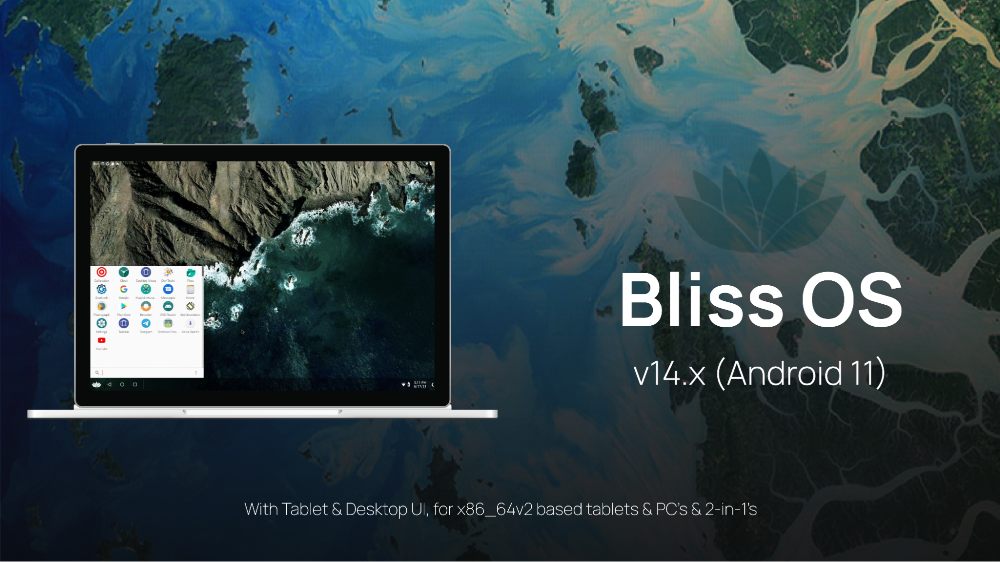
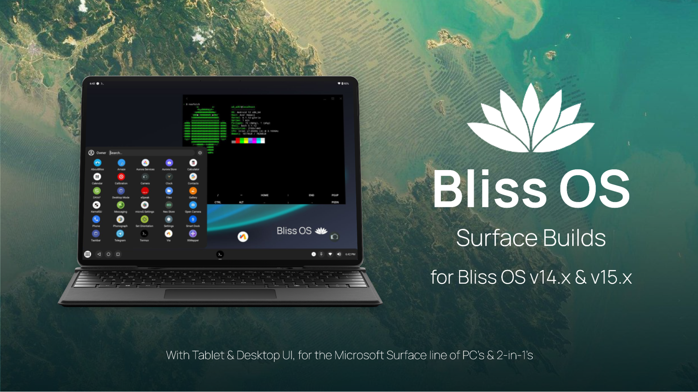
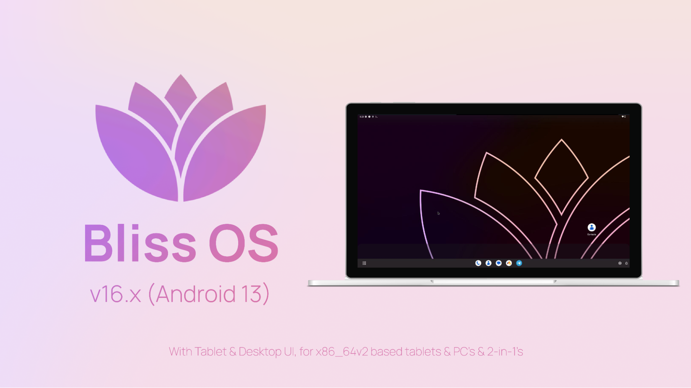
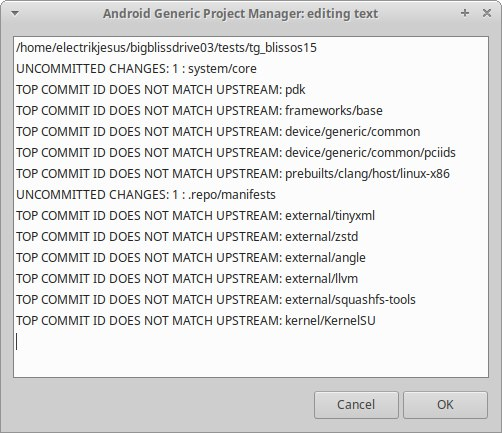
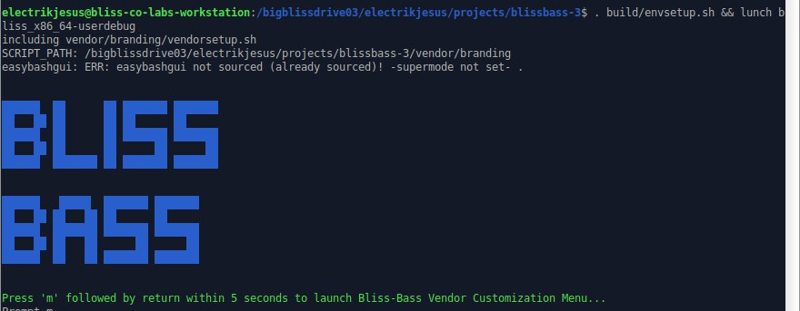
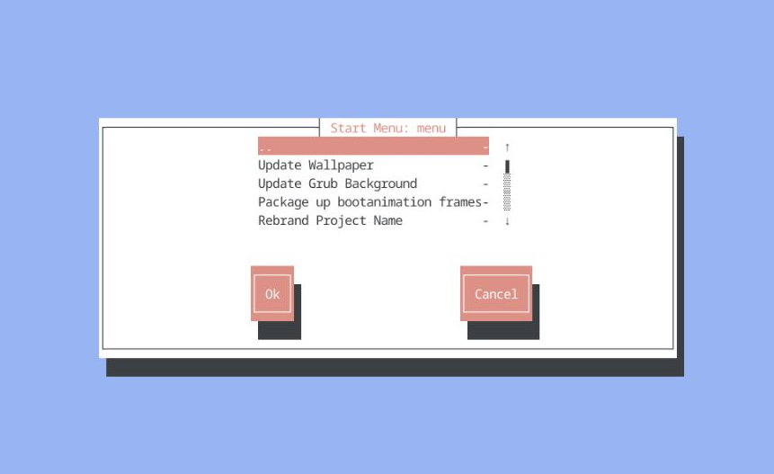

# A State of Bliss : A Blissful Return - 2nd Quarter 2023

The last couple months have been pretty busy at Bliss. Since January/February, we’ve been able to get a lot of work done on many different fronts. With my return to Bliss, we’ve started a collaborative contract development and consulting firm named [Bliss Co-Labs](https://blisscolabs.dev/), and have been working on a few client projects. Without letting the open-source side of things skip a beat, we’ve also been busy making changes and working on quite a few new updates and projects. So we think it’s about time to at least announce a few of the changes we have in store, as well as a few announcements for new projects or major project updates. 

## Updates

Let’s start with the release updates first. HMTheBoy154 has been busy pushing out some truly amazing innovations for Bliss OS, bringing the platform to support many more devices, and expanding its configurable layers past the graphics stack, and into many others. 
He has this to say about what has been going on recently:

*Ever since Jon joined Esper, I’ve decided to continue his work. If you join our Telegram group, you’ll notice that a lot has changed since the last releases like Bliss OS 14.3 or 15.1. In this post, let’s take a look at what’s new in these versions.*

### Bliss OS v14.10 Release



*Compared to 14.3, the new Bliss OS 14.10 has improved a lot. Although there are some features that I have to remove for example the long iso name to explain what's inside the build or Gearlock (while it is a really good recovery solution for Android-x86, I still decided to remove it because it need to be rewritten), I've been putting a lot of changes into it, some of them were on my old [ProjectSakura-x86](https://forum.xda-developers.com/t/beta-11-projectsakura-x86-for-pcs-official.4329533/) builds. Also, please remember that most of these are also available in Bliss OS 15.8 builds and more on that later.*

*Here are the new changes :*

- Taskbar apps like farmerbb's Taskbar or axel358's Smart Dock are being updated to the latest.
- Kernel has been updated to 5.15.x, this is the same kernel I use on PS-x86 but now with more optimization & hardware support. Also mgLRU, eBPF, DMA-BUF Heap, etc are all being enabled.
- ESDFS is being used to bind mount apps' data just like ChromeOS, this is to fix apps that can't be able to read data or obb on Bliss, causing it to crash.
- Using Intel's Bluetooth HAL, with some changes from Android-x86 to support more Bluetooth cards than just Intel one.
- You can now make a list like [modprobe.conf](https://linux.die.net/man/5/modprobe.conf) at /data/vendor/modules.options or /data/vendor/modules.blocklist if you want to blacklist a module.
- Bliss can now show the device information just like the old Bliss OS 11 or Android-x86.
- virt_wifi is now disabled by default, you can still use it with VIRT_WIFI=1
- If you are using a tablet or convertible laptops that have an accelerometer, our iio sensors can now be able to rotate the screen.
- PGO optimization for art. This is a feature by Intel to enhance VM workload performance, you can read about it [here](https://www.intel.com/content/www/us/en/developer/articles/technical/enhance-vm-workloads-performance-with-pgo.html). 
- AutoFast JNI, this is also [another feature by Intel](https://01.org/blogs/2019/intel-optimizations-android-pie-runtime-compiler) to improve performance on Android running in x86 hardware . 
- zram is enabled by default with zstd compression.
- aptX & aptX HD Bluetooth codecs support using Android 13's encoders. Bliss is the first Android build on x86 hardware to get this publicly.
- `toybox` is being upstreamed with additional tools such as `eject` or `rfkill`. Also, we've included usb.ids and pci.ids for `lsusb` & `lspci` so you can check the USB or PCI devices name.
- If you want to mount all of your partitions into Bliss, add `INTERNAL_MOUNT=1` into the cmdline.
- If you want to try AOSP's experimental "PC Mode", add `PC_MODE=1` into the cmdline and try.
- If you want your Bliss OS build to be recognized as a Google Play Games for PC image, add `HPE=1` into the cmdline and reset Play Store.
- You can now force your mouse click as touch, this is to help fixing apps that only use touch input only.
- Mouse acceleration can be disabled ,also scroll wheel too.
- Night Light is now available.
- BoringDroid is back. 
- For media, while using OMX.ffmpeg codecs as usual, I also provide Codec2 implementation of ffmpeg codecs, made by Micheal Goffioul. Alongside with that, new VAAPI drivers for newer Intel iGPU & other hardware is also being built to support hardware acceleration decoder. I also include a lot of parameters that you can use to get the best result from Bliss OS, you can find it at our [Docs](https://docs.blissos.org/configuration/configuration-through-command-line-parameters/).
- For graphics, our graphics stack is being improved significantly compared to the previous builds, not only that, like media, we provide a lot of options through parameters too. You can see some of our changes here like : 
  * Vulkan is now being enabled by default. `VULKAN=1` is dead, long live `VULKAN=1`. 
  * Mesa is being updated to latest version (23.1) with LLVM16 for AMDGPUs.
  * Also in Mesa we've activated xmlconfig, with this you can create custom configuration for apps & games related to graphics like spoofing GPUs name & vendor. We will update more information in our Docs soon.
  * While we include a lot of Gralloc & HWC options and we pick the best one depending on what GPU Bliss is running. So if you don't want to play with any of this, you can just be sure that you are running the best one that is being tested by us & the community.
  * For minigbm (and all the different variations that we have), you can switch to Gralloc4 with `GRALLOC4_MINIGBM=1` parameter.
  * You can force OpenGLES version with `FORCE_GLES=<version>` parameter.
  * For software rendering solutions, not only we are using Swiftshader, but also SwANGLE. A combination of ANGLE EGL driver & SwiftShader Vulkan made by Google. SwANGLE is already being used on Android 13 but we've backported it.

*And for the first time, Bliss is using the new KernelSU for root solution. Not only that, Bliss OS is the first x86_64 Android build ever to integrate KernelSU into it.*


*These builds will also be moved from our development branch to our stable branch, so you will soon find these builds on our [blissos-x86 sourceforge](https://sourceforge.net/projects/blissos-x86/) (where we release our stable builds).*

### Bliss OS v15.8 Release


*Bliss OS 15.8 has a different starting point than Bliss OS 15.1. Firstly, Bliss OS 15.8 is based on Android 12L unlike 15.1 which uses Android 12. Second, Bliss OS 15.8 common tree (`device/generic/common`) is based on my 14.10 tree with a few patches instead of using 15.1 one. Which is why I said that most of the new features from 14.10 are also available on 15.8. All the changes you see in 14.10 are also in this version, but with Android 12L instead.*

*These builds will also be moved from our development branch to our stable branch, so you will soon find these builds on our [blissos-x86 sourceforge](https://sourceforge.net/projects/blissos-x86/) (where we release our stable builds).*

### The return of Bliss OS Surface Builds



*For Bliss OS, Surface Builds used to be a thing in Bliss OS 11 days with a few builds available. Now we’re happy to announce that we’re bringing back the build with a newer kernel (5.15) using patches from [linux-surface](https://github.com/linux-surface/linux-surface) and using the latest ipts/ithc kernel driver as well as iptsd daemon to support touchscreen.*

***NOTE** : Not every Microsoft Surface device has to install surface build to make it work, some can just use generic builds, please check our [Documentation](https://docs.blissos.org/) for more info.*

## Releases

HMTheBoy154 has been working on a super secret project for Bliss, and we are happy to announce the initial beta release of Bliss OS v16.6 (Android 13) for x86_64v2 PC’s, laptops, tablets, etc. Check the release notes for that below. 

### Bliss OS v16 Beta Release



*Yes, you heard that right. Today I'm happy to announce the first public beta build of Bliss OS 16. The development has already started since October 2022 and I've been working together with not only Android-x86 members & contributors, but also with BlissROMs members and we've made a lot of progress since then. We even work with the LibreMobileOS team to fix some issues like freeform.*

*Currently BlissOS 16 is on 16.7 to match with the version on BlissROMs. While it’s still on Beta stage, we can't wait to release our new images so you can experience them.*

### New Bliss OS Logo Announcement

With the Bliss OS 16 announcement, Designer [XelXen (aka WildWaze)](https://github.com/xelxen/) has also been working with us on a redesigned logo for this and future releases. Not only that, he also included some new wallpapers for us to match with this new design elements.

```
“The new logo of BlissOS depicts a human figure standing in between petals of lotus, representing the transparency and diversity of the operating system. The figure also holds a perfectly shaped lotus flower, which is the emblem of BlissLabs and perfection.”
```

Logo 1            |  Logo 2
:-------------------------:|:-------------------------:
  | 

Wallpaper 1            |  Wallpaper 2
:-------------------------:|:-------------------------:
  | 

Wallpaper 3            |  Wallpaper 4
:-------------------------:|:-------------------------:
  | 

### Android-Generic Project Manager Release

We are excited to announce the release of Android-Generic Project Manager (AGPM), a tool that makes it easier to build and configure AOSP based projects. AGPM provides a number of features that can help you save time and effort, including:

- Automatic repo init: AGPM can automatically initialize a new AOSP project or update an existing one.
- Python virtualenv support: AGPM can wrap your project in a Python virtualenv, which allows you to install packages and run scripts without affecting the rest of your system (quite handy when you are using a shared server over ssh and do not have root access for installing packages).
- Check Project Status: AGPM can check a project folders repos against the manifest, and it will build a list of any repos with uncommitted changes, or if the repos are not pushed yet. 
- Option to push changes: Depending on what Update Checking finds, you can push your updates to the repos found to be behind
- Common Tools: Create New, Update, Delete, etc. 

Screenshots:


(Main Menu window: Zenity mode)



(Check Project Status results: Zenity mode)

Compatibility:

AGPM is designed to be flexible and extensible, so you can add your own project configurations and features. Currently, we support the following projects:
- AOSP
- Bliss ROM
- Lineage OS
- Bliss OS

We have a planned features list a mile long, and we are always working to add support for more projects. If you have any feedback or suggestions, please feel free to open an issue on the [AGPM GitHub repository](https://github.com/android-generic/ag-project-manager).

We hope you find AGPM to be a useful tool for building and configuring AOSP based projects.

### Android-Generic Project (v2023) Release

We are excited to announce the release of Android-Generic Project (v2023), a major update that brings many new features and improvements.

Key Features

- Support for multiple targets: AG v2023 can now be used to build images for a variety of targets, including Android phones, tablets, Raspberry Pi, emulators, TVs, and PCs. As usual, we start things out with the PC target, and let that act as an example for the rest.
- Target-based system: AG v2023 uses a new target-based system that makes it easier to build images for specific targets.
- Target variants: AG v2023 now supports target variants, which allow you to build images with different configurations for different targets. This system is used to have separate base structures for targets. So for the PC builds (target), we will have the variants: Android-x86 base, Bliss OS base, Bliss OS Go, etc.
- Conditions for menu items: AG v2023 allows you to use conditions to control the availability of menu items. This makes it possible to create more complex and flexible menus.
- Addon templates: AG v2023 includes addon templates that you can use to create your own addons. Addons are a great way to extend the functionality of AG.
- Public and private addons: AG v2023 supports both public and private addons. Public addons are available to everyone, while private addons are only available to a select group of users. 

Updates

In addition to the new features listed above, AG v2023 also includes a number of updates and improvements. These include:
- Updates to the easy-menu system for more dynamic menu options.
- A new targets based system.
- The ability to add target variants.
- The ability to lock the process with conditions per option.
- Updated api-32 support.
- Added api-33 support.
- Reworked manifest structure to include in targets.
- Added addon template for contributors to use to create their own addons.
- Added Targets template for contributors to use to create their own targets.
- Reworked open/private addon structure and added new addons.

Generic/PC Addons

The following new addons have been added for generic/PC targets:
- Configurable battery stats addon
- Rotation/orientation configuration options through Grub
- Expanded LMKD configuration addon
- LMKD tuning options through Grub
- Memory tuning options through Grub
- Performance tuning options through Grub

Licensed Addons

The following new addons have been added for licensed targets:
- Recents tuning addon
- Addons for locking various features
- Customizing new user functions addon
- Configuring packages on boot (hide/disable/unhide/enable)
- Addon for locking the ability for the user to change settings

Special Requests? contact us

We hope you enjoy these new features and improvements!

### Bliss Broad Apparatus Support System (Bliss-Bass)
*(Automated Vendor Customization Layer for Bliss OS / Bliss OS Go)*

Bliss Broad Apparatus Support System (Bliss-Bass) is an automated vendor customization layer for Bliss OS / Bliss OS Go (and eventually BlissROM). It is a toolkit that can be used to help with rebranding, customizations, and app changes for Bliss OS based builds. The toolkit comes with a variety of functions, including:
- An autopatch function that applies all required changes to the Bliss OS build.
- The ability to define custom sets of changes to be applied before customization.
- Integration with AOSP's build system, which allows a variety of tools to be accessed before the lunch process starts.
- The ability to display a customization menu from the pre-lunch hook, using either dialog or zenity, depending on whether or not a GUI is detected.

The Bliss-Bass toolkit is designed to make it easier for users and companies to start off using Bliss for their products. By automating many of the tasks involved in rebranding and customization, Bliss-Bass can save time and energy, allowing users or engineers to focus on the creative parts of the process.

Here are some additional details about the autopatch function:
- The autopatch function is available from the command line using ‘check_patchsets’ or through the menu.
- The autopatch function can be used to apply a variety of changes to the Bliss OS build, including changes to the kernel, bootloader, system image, and vendor image.
- The autopatch function can be used to define custom sets of changes to be applied. This can be useful for organizations that need to make specific changes to Bliss OS for their own products.

Just like some of our other toolkits, this project integrates itself into AOSP’s build system and allows a variety of tools to be accessed before the lunch process starts:



And when you trigger the customization menu to display from the pre-lunch hook, it can use ‘dialog’ if there is no display or GUI detected:



Or `zenity`, to display the menu options if it does detect a GUI:


Further development is being made to add even more options and tools to Bliss-Bass. The project is open source and available on GitHub at https://github.com/BlissRoms-x86/platform_vendor_branding.

### Bliss OS Linux Hybrid Preview
*(Bliss OS Go edition)*


Read More in last weeks release post: [Bliss OS Linux Hybrid Preview](https://blog.blissos.org/bliss-os-linux-hybrid-preview)

## New Collaborations
### LibreMobileOS


We are excited to announce our collaboration with [LibreMobileOS](https://libremobileos.com/), a project that develops and promotes privacy-focused mobile operating systems. As part of this collaboration, we have been working with LibreMobileOS to develop LMODroid-x86, a version of their operating system that is designed to run on x86-based tablets and PCs.

LMODroid-x86 was created using Android-Generic Project v2023, a free and open-source prototyping toolkit used to create x86 based Android projects, and other targets. The operating system will be pre-installed with a variety of privacy-focused applications, including a web browser, desktop mode, digital wellbeing (coming soon), and file manager.

We believe that LMODroid-x86 will be a valuable addition to the LibreMobileOS ecosystem. The operating system will provide users with a privacy-focused alternative to the major mobile operating systems, and it will help to promote the use of open-source software.
We would like to thank LibreMobileOS for their collaboration on this project. We are excited to work with them to develop LMODroid-x86 and to help make it available to users around the world.

We would also like to thank HMTheBoy154 for their contributions to this project. Their hard work and dedication has been essential to the success of the project.

We are confident that LMODroid-x86 will be a valuable resource for users who are looking for a privacy-focused and secure mobile operating system. We look forward to sharing more information about the project in the coming months.
