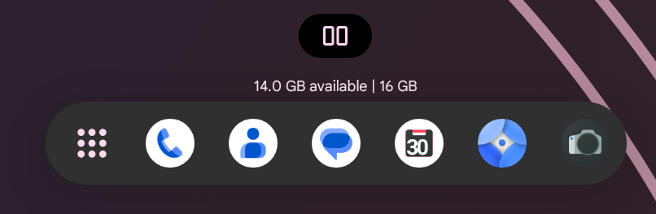

# BlissOS 16.8 release

July is a busy month for us here in BlissLabs. With the release of Android 13 QPR3, we've decided that both BlissROMs and BlissOS this time will release the new updates on the same day which is pretty special for both of us.

You can check out all the changes BlissROMs made here for more info : https://blog.blissroms.org/2023-07-15-typhoon-16.8-updates-jul-2023/

## BlissOS exclusive changes

Beside from QPR3 and the changes made by BlissROMs, BlissOS offer some exclusive changes too. There are 3 main things :

### New About Tablet design

BlissROMs gave us the new About Phone/Tablet design, here we made a few modification to it. First, Processor name will show the actual CPU name of the device instead of getting the SoC name with prop `ro.soc.model`. Device name is a tablet instead of a phone and the screen to show the wallpaper is set to horizontal with 16:9 aspect ratio. Making this a nice tablet info screen for BlissOS.

### Exclusive Launcher Features

To say this is an exclusive is a bit odd, because submitted the patches to Gerrit. But BlissROMs decided to put these in the next release (16.9) so we just gonna say that this is exclusive to BlissOS 16.8 :p. 

First, the Split button is now properly modified based on the new Recents button layouts. 

Not only that, you can also turn it off in Recents Settings

Next, by default memory info in Recents is on the top of the screen, we've provided an option to move it down again. We also calculated and change the margin of memory info when you are on Persistent Taskbar or Transient Taskbar so that meminfo will not be covered by taskbars.

Finally, **Developer Options is back** ! You can find it under Misc Settings when Developer Options in Settings is enabled.

### Shipping with Kernel 6.1

BlissOS 16.8 will be the first build to ship with Kernel 6.1. Currently I'm still using the same recipe, Google's Common Kernel `android14-6.1-lts` branch with xanmod patches and some fixes for Android-x86 but because this is Kernel 6.1, more hardware will be supported especially the Steam Deck with some drivers & fixes from Valve that they put on their SteamOS' kernel.

And that's it for this month with the new release of 16.8, we hope that you will enjoy it even though for BlissOS 16 it's still in Beta stage.

#StayBlissful #FeelTheWind🌪
