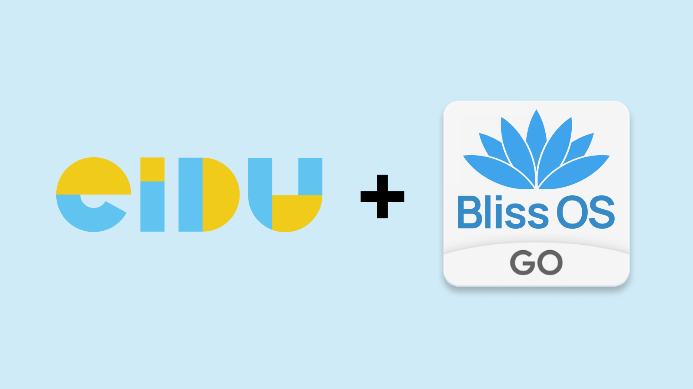

# Collaboration Announcement

## New Collaborations

### [pilot] EIDU - Taifa ElimuTab

Bliss Co-Labs and [EIDU](https://eidu.com/), an organization that builds innovative solutions to digitize education in low and middle-income countries at scale, have partnered to bring an Android Go 12.1 variation of Bliss OS to the aging Windows tablets used by Kenya public primary schools. The pilot program aims to allow millions of devices a second-life through the use of Bliss OS, which is specifically tailored to the devices' hardware and capabilities.

Bliss OS is a lightweight operating system that is designed to run on x86 Windows & Linux devices. It is based on Android, but it has been optimized for performance and battery life. Bliss OS Go is a version of Bliss OS that is designed for lower-powered devices, such as the Intel Atom based Windows tablets that are used in Kenya.

The pilot program will test the feasibility of deploying Bliss OS Go on the Windows tablets. If the pilot is successful, it could lead to the deployment of Bliss OS Go on millions of devices, which would provide students in Kenya with access to a more reliable and affordable educational platform.

Here are some of the benefits of using Bliss OS Go on the Windows tablets:

* Improved performance: Bliss OS Go is designed to run on low-powered devices, so it can provide a significant performance boost over Windows. This will make it easier for students to use the devices for learning.
* Longer battery life: Bliss OS Go is also designed to conserve battery life, so students can use the devices for longer periods of time without having to worry about running out of power.
* More affordable: Bliss OS Go is a free and open-source operating system, so it is more affordable than Windows. This will make it possible for schools to deploy Bliss OS Go on more devices, which will benefit more students.

We believe that Bliss OS Go has the potential to make a significant impact on education in Kenya. We are excited to partner with EIDU on this pilot program and we look forward to seeing the results.
