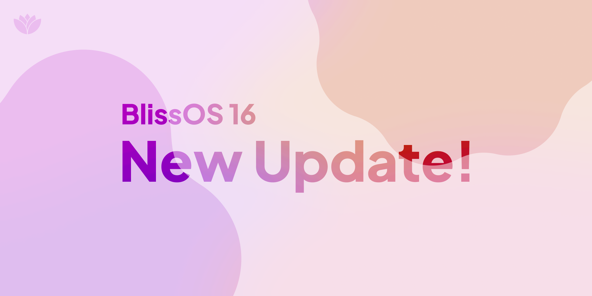

# What's new in BlissOS June 2024 releases ?

We've uploaded new builds into our SourceForge page. Here are the new things that we added to these builds:

- These new updates include BlissOS 14.10.2, BlissOS 15.9.1 & BlissOS 16.9.6. All of them are now on latest May 2024 Security Patch, with BlissOS 14.10.2 is on Feb 2024 + unofficial patches from Lineage. We've decided to keep 14.10.2 date intact while still merging new patches.
- We've updated the graphics stack including Mesa 24.0.8, LLVM 17.0.6 (for radeonsi), merging main branch for minigbm & drm_hwcomposer. Libva (and also libva-utils) is being updated to 2.21.0
- For audio, there are some changes to it that we want to pointed out:
    1. We've updated sof-firmware to version [202403](https://github.com/android-generic/vendor_intel_proprietary_sof-bin/tree/202403). 
    2. On BlissOS 16, we set snd_hda_intel driver to be [deferred on purpose](https://github.com/BlissOS/device_generic_common/commit/8e64a9af5d5472fc3841092c8e3517dab532050b). This is to fix the issue that on some old hardware audio is not working due to snd_hda_intel failed to probe the codec.
    3. Finally and this is one of the most exciting change that we want to show you: [**we've refactored the whole audio initialization stage on init.sh**](https://github.com/BlissOS/device_generic_common/commit/2f8441797c9bdb2800d8fc969588980bf1aa1b75). his refactor provides 2 features:
        * After the first boot, the whole alsa state will be exported to /data/vendor/asound.state so the next boot alsactl will load this file instead of running the whole initialization stage again. This allow users to be able to play around with tools such as alsamixer and then save their own changes. Note that we don't have automatic save implemented yet so you'll have to type "alsa_ctl store" everytime you make a new change.
        *  We're now support more audio cards that are in some Intel SoCs especially those tablets with Intel Atoms. By using alsaucm to enable HiFi verb & all possible devices, we can now be able to support most of these audio cards (https://x.com/blissos_org/status/1788877000511528961). Basically if you check dmesg and saw "no backend DAIs enabled for Audio Port" error spamming then yea that is now fixed.
- We've created a new cmdline parameter : [FORCE_TSCAL=1](https://github.com/BlissOS/device_generic_common/commit/e47dddfa84713c0733f24b0c6ef8b43d9d63b6b9). Some users want to use the TSCalibration app to calibrate the touchscreen, but they didn't know that to make it works you need to run an extra function on init.sh, so we decided to make an option to force it. To avoid users confusion, we also hide the TSCalibration app if that function on init.sh is not being called. You can watch the preview here : https://youtu.be/p5z9yNhCNKE
- All builds (except Zenith) comes with kernel 6.1.84. There are a few things we've changed other than just upstreaming the kernel. 
  1. We've integrated soc_button_array driver directly into the kernel. This helps fixing the side buttons not working on some Microsoft Surface devices.
  2. We've [removed](https://github.com/android-generic/external_kernel-drivers/commit/e27764a43e29e837dda0e57970583da861dfd53c) the external rtl8723bs driver we are using and instead switched to the staging driver on the linux kernel source. 2 users feedback to us with working wifi after switching to it. But they also report to us they need to reboot in order to make it work. 
  3. We also [removed](https://github.com/android-generic/external_kernel-drivers/commit/b7ab4c7e7b071fe98f0b02f0b013b5b8d232e864) gslx680-acpi driver out from our external drivers list. With the new cmdline option on touchscreen_dmi, we're now fully embracing silead_ts driver. You can read here to learn more about how this can help your silead touchscreen working on BlissOS: https://x.com/blissos_org/status/1795048924346032555
- We've brought [evtest](https://github.com/android-generic/external_evtest) tool to all of our new BlissOS builds as mentioned on [here](https://x.com/blissos_org/status/1795048933187518559)
- BlissOS Zenith is now using the latest Kernel 6.9.3 stable kernel. Different from the last build which uses 6.6 kernel from Google's [android15-6.6](https://android.googlesource.com/kernel/common/+/refs/heads/android15-6.6) branch, this is a new kernel that was made using [android-mainline](https://android.googlesource.com/kernel/common/+/refs/heads/android-mainline) branch, we got the source right when Google merge stable 6.9 and upstream it. Then we also merging patches from different places like [Android-x86](https://github.com/android-generic/kernel-zenith/commits/6.9_android-x86), [xanmod](https://github.com/android-generic/kernel-zenith/commits/6.9_xanmod), [Nobara Linux](https://github.com/android-generic/kernel-zenith/commits/6.9_nobara), etc. 
You can check out the new Zenith kernel source [here](https://github.com/android-generic/kernel-zenith/commits/6.9/)

During testing, we've found some critical bugs that we would like to address:

- We've updated KernelSU but only to version 0.9.2. While the latest version 1.0 is out, ever since 0.9.3 there is a bug on KernelSU that prevent us from updating. On live boot, KSU will working fine as intended but once installed it will show "not installed" and unusable. We've reported this bug to KernelSU's Github Issues and we're waiting for a fix: https://github.com/tiann/KernelSU/issues/1783
- When we say "we can now be able to support most of these audio cards", not only does it mean we haven't tested all of the audio cards, but also there are some that is not working right now. For example an user has reported to us on Discord that his audio is not working and it's a Thinkpad 10 that currently using "cht-bsw-rt5672".
- All of our audio test on Intel Atom SoCs have 1 bug in common: playing anything with audio for a while and then suddenly the audio stream is cut, producing strange buzzing noise that you need to temporary pause the audio to fix until it happen again.
- **Users on BlissOS Zenith please pay attention to this !** Currently Zenith kernel has an issue, and that is KernelSU.... again ! KernelSU while can be able to show that it's working & can grant root for apps, apps can not be able to call su at all ! For now you can't grant root for app but if you want to run any commands with root you can boot with `androidboot.enable_console=1` and use Alt + F1 tty.

We're hoping that we can be able to fix these bug in future updates. In the meantime, please enjoy these new builds from us. Thank you for reading this blog post and supporting BlissOS.

#StayBlissful
