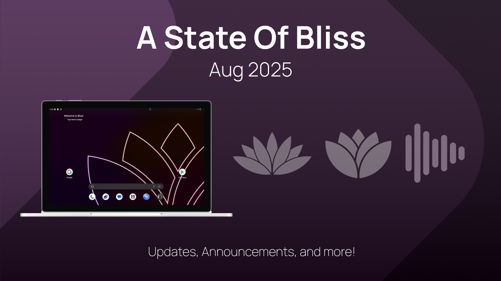

# Bliss Development - August 2025

Let me tell you how busy we are without telling you we're busy... We are entering the end of the 60 day mark for transitioning on Bliss OS side of things. In this last 30 days, we've been able to finalize a method for tracking usage of our builds while making the data as anonymous as possible. The result will be a tiny service app that loads at the device start, and once the internet is available it will report the encrypted build info, and some minimal device info to our server so we can have a valid idea of how many devices are using our source or our images in the wild. 

Our server upgrades are also starting to come online, piece by piece, which has given both the Bliss OS and Android-x86 teams a future proof build solution to help them out for at least the next few years. The hardest part to this setup was not getting the hardware put together though. Instead it was securing the connections to not allow the server to be constantly hit by attacks (yes, for some reason, there are entire teams of people with nothing better to do with their time than to try and attack the build infrastructure of our open-source projects... Like, what are they expecting to find? Something not free and open-source??...).

Along side those efforts, we have also started unification efforts for all sides of Bliss (ROM/OS/Business) where we took a step back, and looked at our project catalog on the FOSS side, and then the product catalog on the business side, and started working on the pieces we could connect in order to help make everything better. We have the initial parts of the plan already in motion and you will see the changes hitting Bliss vendor (ROM and OS sides) very soon. 

Speaking of the ROM side, and PC sides, the progress on both those website updates has been going pretty well and we are going to be using more up to date web stack for them both in order to better serve our maintainability moving forward. With the majority of our new contributors having experience with Typescript and React, we felt that was the right direction to head if we are ever to allow things to grow on the website projects. 

The PC side is also knee deep in the doc-swamp right now also. Since there is so much changing for Bliss OS builds and how they are installed, updated, and expanded, we have a lot of old documentation that will no longer be needed, and on the flip side, a lot of new documentation that is needed.   
That should just about cover the big items. There is a lot more we won’t mention just yet. You will have to wait and see for those updates when they hit. 

Till next time, have a Blissful day\!

Bliss OS Development Team